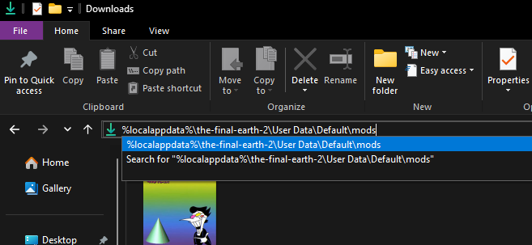
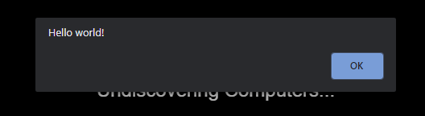
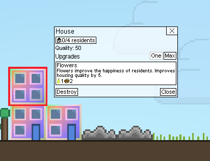

# Getting Started

This page will walk you through creating a mod for the Steam version of The Final Earth 2. This process may change in the future, as the developer has stated that modding is a work in process feature. Currently, creating a complex mod requires some extensive knowledge of the game code, but it's fairly simple to get started so long as you have some basic programming experience.

## Requirements

To be able to mod The Final Earth 2, you will need to have [the Steam version of The Final Earth 2](https://store.steampowered.com/app/1180130/The_Final_Earth_2/) installed. Mods cannot be created for the mobile or web versions of the game, and there are no plans to support this in the future.

You will need a text/code editor of some sort. There are plenty of programs out there that can do the job, such as [Visual Studio Code](https://code.visualstudio.com/) and [Notepad++](https://notepad-plus-plus.org/). I personally recommend Visual Studio Code, as it is what I am using to write the text on this very page, as well as what I will be using when making the mods in these tutorials.

You will also need an image editor with transparency support (this means that no, you cannot just use Microsoft Paint). There are various free ones, such as [Paint.NET](https://getpaint.net/) and [GIMP](https://www.gimp.org/), and high quality paid ones like [https://www.aseprite.org/](Aseprite). I use Paint.NET for most things since it's free and it works great with pixel art.

Lastly, you are going to have to know how to code at least a little bit. This tutorial isn't going to get too deep into the stuff you will need coding experience for, but future ones will. If you've done something even as simple as Scratch for long enough you probably wont have too hard of a time, however it will still be difficult to figure out how to mod without knowing a little bit of JavaScript beforehand. All mods for The Final Earth 2 are written with JavaScript (which is a completely different language from Java despite the name), and if you want to learn the language the official [MDN docs](https://developer.mozilla.org/en-US/docs/Learn/JavaScript/First_steps) are a great place to start.

## Setting up the mod folder

To start, you will need to open up file explorer to your mods folder, which is located at `%localappdata%\the-final-earth-2\User Data\Default\mods`. The easiest way to do that is to just paste it into the address bar in the file explorer.



Once there, you will want to create a new folder to contain your mod, named anything you want. This folder is referred to as the mod folder, and it stores all of the mod files, including custom textures and sprites in the form of `.png` files, custom data files written in JSON, and the code for your mod written in JavaScript.

## Hello world!

If you aren't new to modding and programming in general, you can skip this section.

In order to ensure that everything is working correctly, we are going to create a simple mod that replaces the Normal House texture in-game, and shows a message box to confirm the mod is running. The easiest way to do this is to simply put the new texture inside of the mod folder with the same name as the texture you are trying to replace. You can go to the [Sprite Browser](/Tools/SpriteBrowser/) to download the sprite named `spr_normalhouse.png` and modify it, but if you don't have an image editor yet, you can still click on my modified texture below to download it. This is the texture I will be using.

!

Once you have your custom texture, either by modifying it yourself or downloading it above, go ahead and put that file into the mod folder and make sure it is named `spr_normalhouse.png`. This will replace the Normal House texture with your custom texture. Now, to make a message box appear, you are going to need to use JavaScript. Create a new file named `mod.js` inside of your mod folder, then edit it with a text editor. Inside you will want to paste the following code:

```js
alert("Hello world!")
```

This will show a message box that says "Hello world!". Right now, if you have been following along correctly, your mod folder should look something like this:


Now it's time for the part where you test your mod!

## The part where you test your mod

This is the part where you test your mod. Given everything has been put where it needs to be, you should see a message box like the one below when the game starts, and the Normal House should have the custom texture you used.




Feel free to make changes to your mod to try out new things. You can press Ctrl+F5 to quickly reload the game to test new changes, and if you are writing new code you can press Ctrl+F12 to open the developer tools.

## Extra Information That Doesn't Really Go Anywhere Else

- Putting any files in a folder titled `dontAutoLoad` will not load them into the game, and require you to load them manually.
- The game will run all `.js` files it can find in your mod folder automatically. By default, the game loads these files in alphabetical order, starting in the base directory and then loading the sub-directories.

## Final Remarks

This tutorial exists to get the mod folder set up and ready for modding, as well as to provide a few examples of what you can do. However, from here on out, you **absolutely 100% will need to know how to code**, and it is highly recommended that you already know how to code in JavaScript. Otherwise, it's going to be really hard to create a mod. If you want to learn the language the official [MDN docs](https://developer.mozilla.org/en-US/docs/Learn/JavaScript/First_steps) are a great place to start.